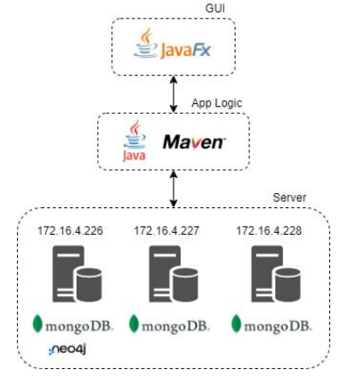
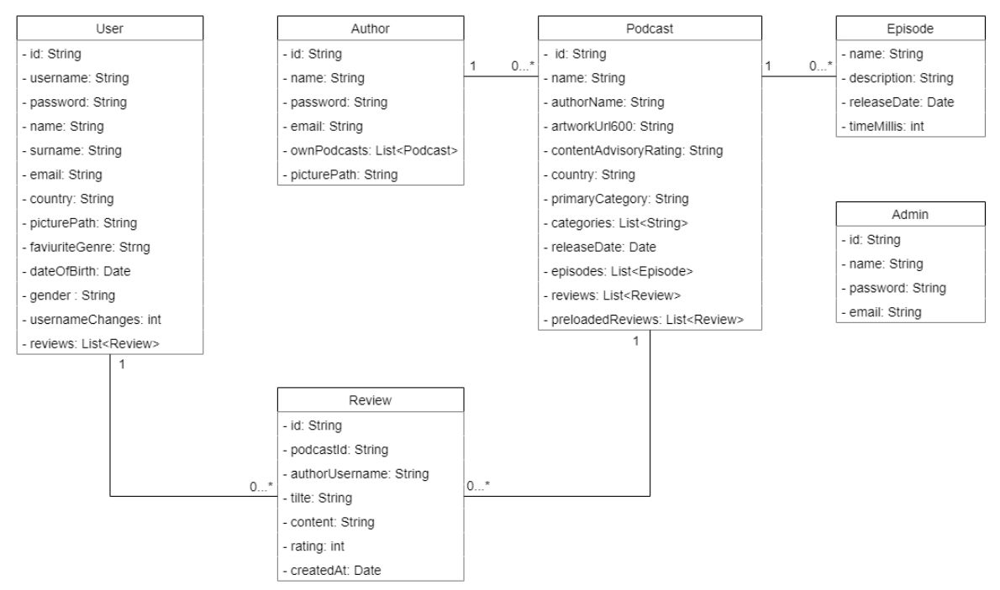
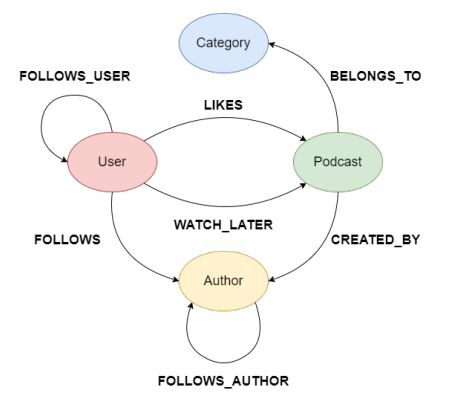
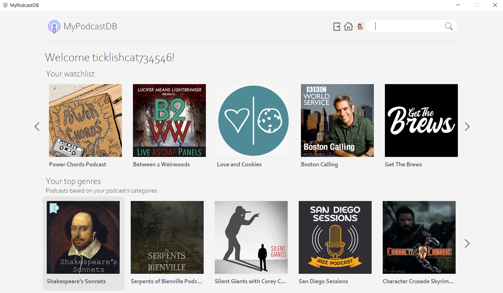
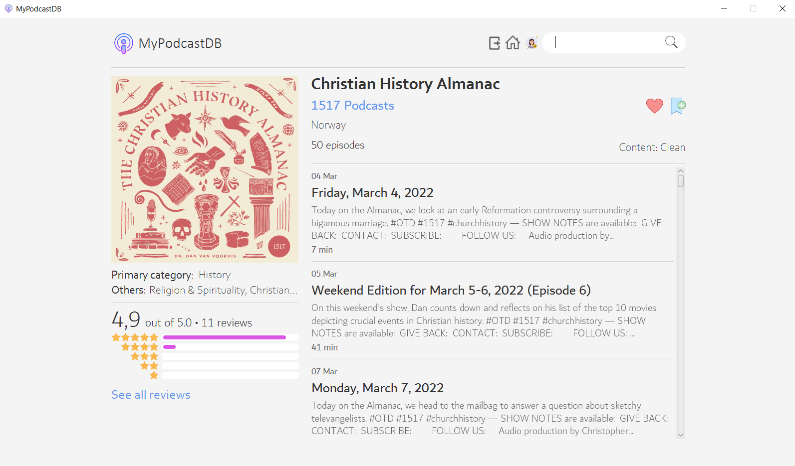
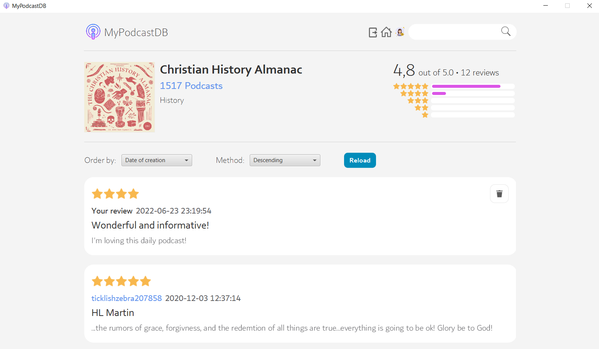
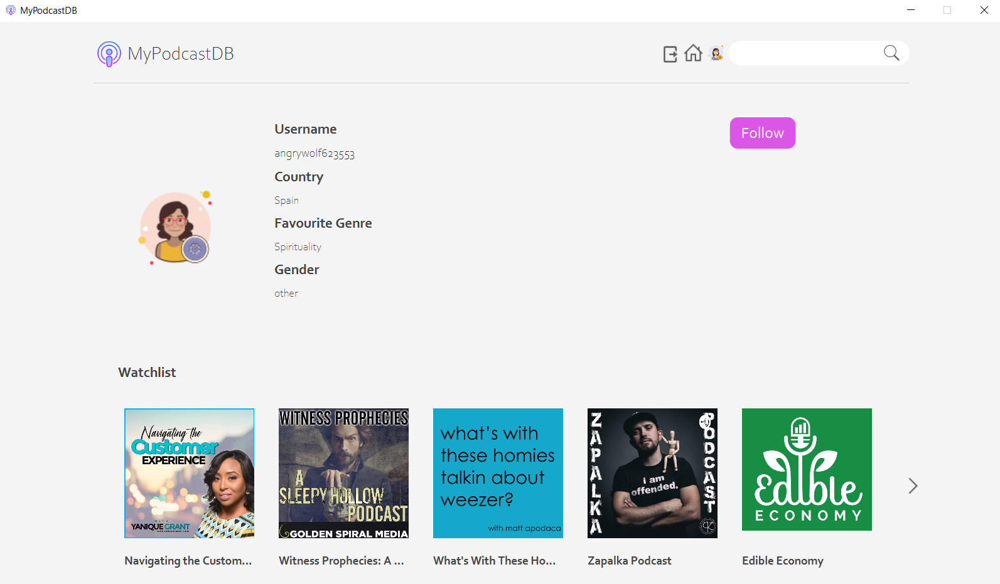
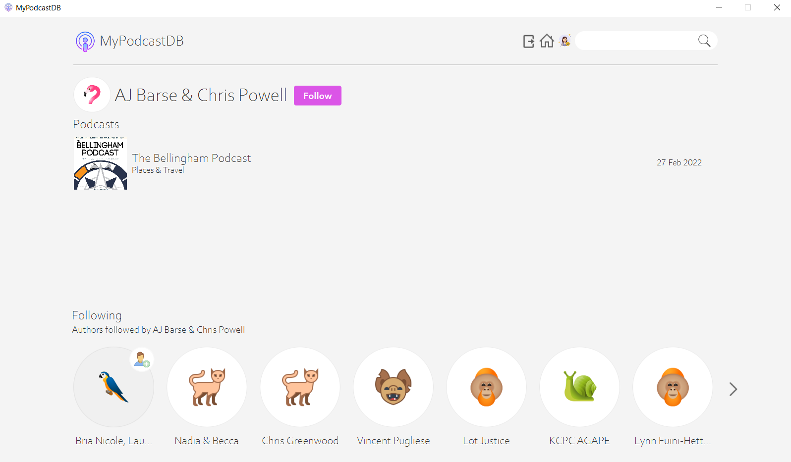

<p align="center">
  
</p>

# MyPodcastDB

Large-Scale and Multi-Structured Databases project.

The dumps of the databases and the source code can be found in the [release](https://github.com/itm-unipi/MyPodcastDB/releases) page. 

## Overview

**MyPodcastDB** is a social network that allows to keep in touch on podcasts, view rankings about the top rated podcasts, the most followed authors and so on. A **podcast** is an
episodic series of digital audio or video files. For each podcast, the application provides
a detailed page that contains information such as episodes, duration, release date and
reviews.

An **user** can like and review a podcast or add it to his watchlist. He can follow an author
and follow other users. These activities will be exploited to provide suggestions to the
user which can help him to find out new authors and podcasts.

On the other side an **author** can create, update and delete a podcast. He can use the
application as the user but he can’t follow users, write reviews, like a podcast or add it
in a watchlist. He can follow other authors.

**Admins** can manage users, authors, podcasts and reviews. They also have access to the
usage analytics of the application.

## Architecture

<p align="center">
  
</p>

## UML Diagram

<p align="center">
  
</p>

## Databases

### MongoDB

Entities:
* User
* Author
* Podcast
* Review
* Admin
* Query

Queries:
* Show podcasts with highest avarage rating
* Show podcasts with highest average rating in a country
* Show average age of users per favourite category
* Show average age of users per country
* Show number of users per country
* Show podcasts with highest number of reviews
* Show countries with highest number of podcasts
* Top favourite categories for male, female and other

### Neo4J

<p align="center">
  
</p>

Entities:
* User
* Author
* Category
* Podcast

Queries:
* Show the most followed author
* Show the most liked podcast
* Show the most numerous category
* Show the most appreciated category
* Show suggested users by liked podcasts
* Show suggested users by followed authors
* Show suggested podcasts liked by followed users
* Show suggested authors followed by followed user 
* Show suggested podcasts based on the category of podcasts user liked
* Show suggested podcasts based on the authors of the podcasts in the watchlist

## User GUI Examples

### Homepage
<p align="center">
  
</p>

### Podcast Page
<p align="center">
  
</p>

### Podcast Reviews Page
<p align="center">
  
</p>

### User Page
<p align="center">
  
</p>

### Author Page
<p align="center">
  
</p>

For more information go to [User Manual](https://github.com/yolly98/MyPodcastDB/blob/main/docs/MyPodcastDB-User-Manual.pdf).

## Package Architecture

```
MyPodcastDB
├── docs
│   ├── MyPodcastDB-Documentation.pdf
│   ├── MyPodcastDB-Project-Presentation.pdf
│   └── MyPodcastDB-User-Manual.pdf
└── src
    ├── main
    │   ├── java
    │   │   └── it.unipi.dii.lsmsdb.myPodcastDB
    │   │       ├── cache
    │   │       ├── controller
    │   │       ├── model
    │   │       ├── persistence
    │   │       │   ├── mongo
    │   │       │   └── neo4j 
    │   │       ├── service
    │   │       ├── utility
    │   │       └── view
    │   └── resources    
    └── test
        └── java
            └── it.unipi.dii.lsmsdb.myPodcastDB
                ├── mongo
                └── neo4j
```

## Authors

* Biagio Cornacchia, b.cornacchia@studenti.unipi.it
* Gianluca Gemini, gianlucagemini98@gmail.com
* Matteo Abaterusso, m.abaterusso@studenti.unipi.it